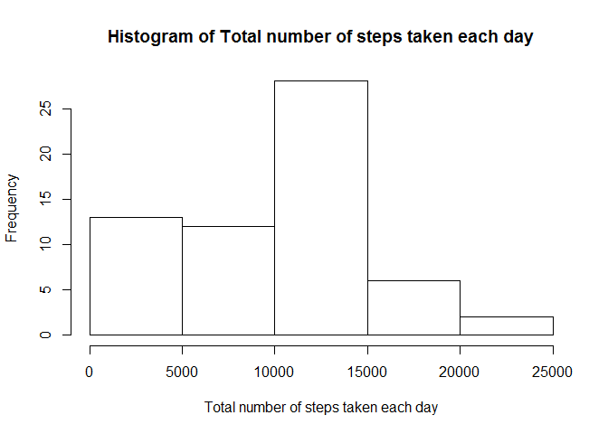
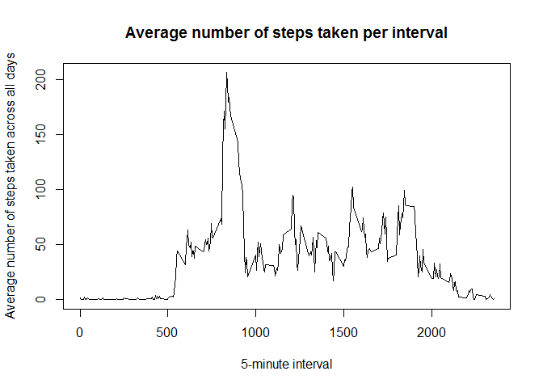
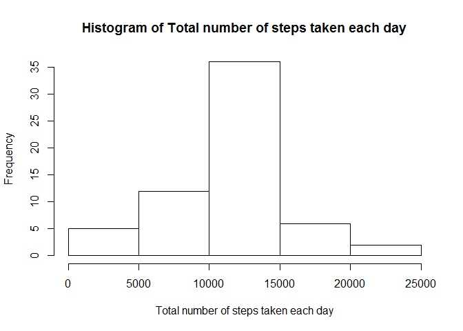

# Reproducible Research: Peer Assessment 1


## Loading and preprocessing the data

```r
## Load the required libraries
library(dplyr)
```

```
## 
## Attaching package: 'dplyr'
## 
## The following object is masked from 'package:stats':
## 
##     filter
## 
## The following objects are masked from 'package:base':
## 
##     intersect, setdiff, setequal, union
```

```r
library(lattice)

## Unzip the activity.zip file to get activity.csv file
unzip("./activity.zip")

## Read data from activity.csv file
activity <- read.csv("./activity.csv")

## Tranform the variable date to proper date object
activity <- transform(activity, date = as.Date(date, "%Y-%m-%d"))
```


## What is mean total number of steps taken per day?

```r
## Calculate the total number of steps taken per day 
activityPerDay <- summarize(group_by(activity, date),
                            totalSteps = sum(steps, na.rm = TRUE))

## Make a histogram of the total number of steps taken each day
hist(activityPerDay$totalSteps, 
     main = "Histogram of Total number of steps taken each day",
     xlab = "Total number of steps taken each day")
```

 

```r
## Calculate and report the mean of the total number of steps taken per day
meanTotal <- mean(activityPerDay$totalSteps)
print(meanTotal)
```

```
## [1] 9354.23
```

```r
## Calculate and the median of the total number of steps taken per day
medianTotal <- median(activityPerDay$totalSteps)
print(medianTotal)
```

```
## [1] 10395
```


## What is the average daily activity pattern?

```r
## Calculate the average number of steps across all days 
activityAcrossDays <- summarize(group_by(activity, interval),
                            averageSteps = mean(steps, na.rm = TRUE))

## Make a time series plot (i.e. type = "l") of the 5-minute interval (x-axis) and
## the average number of steps taken, averaged across all days (y-axis)
plot(activityAcrossDays$interval, 
     activityAcrossDays$averageSteps, 
     type = "l",
     main = "Average number of steps taken per interval",
     xlab = "5-minute interval",
     ylab = "Average number of steps taken across all days")
```

 

```r
## Which 5-minute interval, on average across all the days in the dataset, 
## contains the maximum number of steps?
activityMaxSteps = 
        activityAcrossDays[ activityAcrossDays$averageSteps ==
                                max(activityAcrossDays$averageSteps), ]
print(activityMaxSteps$interval)
```

```
## [1] 835
```

## Imputing missing values

```r
## Calculate and report the total number of missing values in the dataset
totalMissing <- nrow(activity[!complete.cases(activity),])
print(totalMissing)
```

```
## [1] 2304
```

```r
## Create a new dataset that is equal to the original dataset 
## but with the missing data filled in.
actComplete <- activity
for (i in 1: nrow(actComplete)) {
        if(is.na(actComplete[i,]$steps)) {
               activityAcrossDaysRow = 
                        activityAcrossDays[ activityAcrossDays$interval ==
                                actComplete[i,]$interval, ]                 
               actComplete[i,]$steps <- activityAcrossDaysRow$averageSteps
        }
}

## Calculate the total number of steps taken per day 
activityPerDayComplete <- summarize(group_by(actComplete, date),
                            totalSteps = sum(steps))

## Make a histogram of the total number of steps taken each day
hist(activityPerDayComplete$totalSteps, 
     main = "Histogram of Total number of steps taken each day",
     xlab = "Total number of steps taken each day")
```

 

```r
## Calculate and report the mean of the total number of steps taken per day
meanTotalComplete <- mean(activityPerDayComplete$totalSteps)
print(meanTotalComplete)
```

```
## [1] 10766.19
```

```r
## Calculate and the median of the total number of steps taken per day
medianTotalComplete <- median(activityPerDayComplete$totalSteps)
print(medianTotalComplete)  
```

```
## [1] 10766.19
```

### Do these values differ from the estimates from the first part of the assignment?
The mean and the median calculated after filling missing values with the mean value of the 
corresponding interval slightly differs from the estimates from the first part of the assignment.

### What is the impact of imputing missing data on the estimates of the total daily number of steps?
The mean and the median calculated after filling missing values with the mean value of the
relevant interval are same.


## Are there differences in activity patterns between weekdays and weekends?

```r
## Create a new factor variable in the dataset with two levels - "weekday" and
## "weekend" indicating whether a given date is a weekday or weekend day.
actComplete$day <- ifelse(weekdays(actComplete$date) %in% c("Sunday", "Saturday"),
                          "weekend", "weekday")

## Calculate the average number of steps across weekday days or weekend days
actCompleteAcrossDays <- summarize(group_by(actComplete, interval, day),
                            averageSteps = mean(steps, na.rm = TRUE))

## Make a time series plot (i.e. type = "l") of the 5-minute interval (x-axis) and
## the average number of steps taken, averaged across weekday days or 
## weekend days (y-axis)
xyplot(averageSteps ~ interval | day,
       data = actCompleteAcrossDays,
       layout = c(1,2),
       type = "l",
       xlab = "Interval",
       ylab = "Number of steps")
```

 
